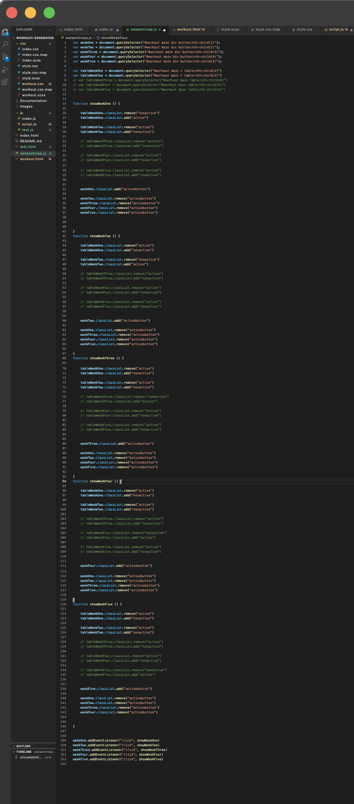

# Workout Generator
## Het proces
Wat een van mijn doelen was bij het stage lopen is het zien, begrijpen en ervaren van code schrijven in een bedrijf. Op school begin je met coderen in 1 bestand en die pas je steeds aan totdat die klaar is volgens jou, dit doe je allemaal in je eentje. Daarna zet je hem online en lever je hem in, soms staat een website al online maar wil je hem toch nog voor de deadline aanpassen dus doe je dat gewoon in het bestand dat online staat. In een bedrijf gaat dit heel anders. Zo werk je met meerdere mensen aan 1 website, komt de klant soms met aanpassingen of klachten als die al online staat en nog veel meer. Hier is het zaak dat alles overzichtelijk is, aanpasbaar blijft en zorgvuldig wordt geschreven, anders kan het al snel een grote zooi worden. Ook is snelheid een factor wat meespeelt bij het programmeren in een bedrijf want tijd is geld. In dit verslag lees je hoe mijn 9 weken coderen aan mijn eigen project zijn verlopen. 

## Het begin van de stage
Bij Fonk gebruiken ze een aantal systemen die ze daarbij helpen. Dat zijn onder andere Sourcetree en Gitlab. Op mijn eerste dag ging ik deze installeren en met elkaar linken door middel van ssh in de terminal. 

Waar Fonk mee begint is het aanmaken van een issue. Dit doe je op gitlab en hierin beschrijf je wat er gedaan moet worden en voeg je mogelijk nog wat extra bestanden eraan toe. Hierdoor wordt het voor je collega’s duidelijk wat er gedaan moet worden. 
Als je aan een issue gaat werken maak je hiervoor een eigen branch aan. Deze branch is een kopie van de main waardoor je niet direct op de main werkt. Deze branch check je uit in sourcetree en nu kan je daarin werken op je lokale bestanden. Als je aanpassingen hebt gedaan en je wilt deze opslaan in de cloud, commit je deze aanpassingen en push je deze vanuit je lokale bestanden naar Gitlab. Nu staat het op gitlab, je hoeft ze niet per se te mergen met de main als je er nog niet klaar mee bent. 
Als je wel klaar bent kan je een merge request aanmaken om jouw branch te mergen en met de main. De merge request assign je aan een van je collega’s om jouw code te bekijken voordat die wordt gemerged. Zo kan die eventuele foutjes eruit halen.

In de eerste week van stage heb ik vooral het werkproces uitgelegd gekregen, content uitgezocht, de opzet voor de html en css gemaakt. Ik had hier al wel wat kennis van maar werken met tabellen en forms had ik nog maar 1 keer eerder gedaan. 
Op Maandag de 13de heb ik een start gemaakt met Javascript, zo heb ik de pagina interactief gemaakt zodat je op bepaalde buttons kon klikken om bepaalde weken kon laten zien. Ook heb ik de donderdag ervoor feedback gekregen op mijn code en zei dat ik wel met scss (een super versie van css) kon werken. Dit doen zij ook en dat gaat sneller en is overzichtelijker dan css. Hiermee ben ik toen bezig gegaan.
Op dinsdag de 12de heb ik echt een hele grote stap gemaakt in mijn Javascript skills. In de ochtend kreeg ik feedback op mijn code en het zag er allemaal erg goed uit. Ik was erg goed bezig met scss en de javascript werkte ook. Wel kon er nog veel ingekort worden (wat ik ook zelf al dacht) in de javascript (ook in de html maar dat komt later). Ze gaf mij wat bronnen, hebben hier en daar wat gespart en wat er uitkwam had ik echt niet gedacht. Ik heb ~ 150 lijnen Javascript herschreven naar 32 lijnen. Door middel van loops en parameters (wat ik nog nooit had gebruikt) lukte het mij om de code in te korten, sneller laadbaar te maken voor de browser, makkelijker te onderhouden en aanpasbaar te maken. Hier de foto’s voor en na:
voor:  na: 
Die week heb ik verder vooral aandacht besteed aan meer functies schrijven met Javascript met de dingen die ik aan het begin van de week heb geleerd. Dit ging erg goed, heb een aantal keer gespart met Stephanie, gezeten met Gijs en feedback gekregen via gitlab op mijn merge requests. Tijdens die momenten heb ik nog meer geleerd over Javascript, namelijk over booleans en switch. Hier heb ik verder nog meer functies mee geschreven. 
Op Vrijdag heb ik nog wat content toegevoegd aan de site en functies toegevoegd waardoor je keuzes die je krijgt voor je progressie, gebaseerd is op de goal die je hebt gekozen. 
In week 3 heb ik ook veel Javascript functies geschreven, ik heb ook weer dingen geleerd over classes en constructors nadat ik hulp vroeg toen ik er niet meer uitkwam. Mijn probleem had ik toen gefixed en later voor een andere functie heb ik dezelfde methode die ik net had geleerd gebruikt en dat werkte heel goed. Aan het eind van de week had ik alle opties die in de selects komen, laten aanmaken door javascript, zo was het veel overzichtelijker, makkelijker aanpasbaar, heb ik data toegevoegd aan de oefeningen en was het nuttig voor andere functies. 
In week 4 begon ik te focussen op de templates waar alle oefeningen die je kiest in moeten komen. Natuurlijk gaat dat niet zomaar, ik heb veel eisen opgesteld wat er moet gebeuren met de content zodat het workout schema zo optimaal mogelijk wordt. Zo moeten push, pull, legs en core oefeningen gescheiden worden en dus niet allemaal op dezelfde dag komen, ook zijn er sommige oefeningen die in secondes worden gemeten en anderen in repetitions. Ik liep die maandag erg te struggelen maar uiteindelijk had ik een manier gevonden om het voor elkaar te krijgen dat elke oefening zijn eigen plek had. Dit was een erg ingewikkelde structuur en terwijl ik het aan het coderen was, verloor ik weer het overzicht. Ik nam een stap terug om het voor mezelf te visualiseren. Dit hielp en ik kon hierdoor weer verder. Met het coderen viel ik wel weer vaak in herhaling, dit kwam doordat mijn focus lag op de naamgeving ipv de kortheid van de code. Op dinsdag kreeg ik feedback en hielp mij om een startpunt te geven om de code eerst even op te ruimen voordat ik weer verder ging. Ik zat nu inmiddels op 1200 regels javascript. 

## Tussen projecten
Ondertussen kreeg ik die week weer veel kennis over bepaalde functies maar ook over hoe Fonk codeert in een echt project. Dit kwam doordat ik een functie mocht maken in een echt project waar zij mee bezig waren dat al over 4 weken af moest zijn. Ik was erg verbaasd en geïntimideerd door de hoeveelheid files er waren. Fonk structureert hun code heel erg in verschillende files en probeert zoveel styling en templates te definiëren voordat ze dit toepassen op components. Ook willen ze zo min mogelijk code zelf schrijven en aanpassen als dat nodig is. Zo hoef je het maar op 1 plek aan te passen als je bijvoorbeeld een kleur wilt veranderen en gebruiken ze libraries van bootstrap en tailwind. Dit structureren van de files leek mij wel toepasselijk in mijn project aangezien ik nu op best veel Javascript heb en ik het overzicht soms verlies. Het gebruik maken van bootstrap en tailwind wil ik ook doen maar dit komt later van pas als ik mij meer ga focussen op de styling van mijn project. 
Verder aan mijn project
Nadat ik aan de issues van Fonk had gewerkt en die af had gemaakt ben ik weer bezig geweest met mijn eigen project. Ik had die week echt een hele grote slag gemaakt met meer functies schrijven waardoor het uiteindelijke idee van de website steeds dichter bij de realiteit kwam. En het korter en efficiënter schrijven van al geschreven functies ging ook erg goed. Ik zat ongeveer op de 1800 regels en heb er uiteindelijk wel 1000 kunnen deleten. De code werd overzichtelijker, makkelijker aanpasbaar en dat gaf echt een heel goed gevoel. 

Na het stage tussengesprek ben ik meer gaan focussen op de styling, hier heb ik toen wat feedback over gevraagd en meer mee gaan variëren. Uiteindelijk is het van dit:

Naar dit geworden:

Aan het begin van week 7 deden zo goed als alle functies het die ik er sowieso in wilde krijgen maar ik had nog wel 6000 regels in de html van de template. Dit waren 10 keer dezelfde stuk voor stuk gekopieerde stukjes. Ik wist zeker dat dit korter kon dus heb ik hier onderzoek naar gedaan. Uiteindelijk is het gelukt om met de template tag dat stukje meerdere keren in de html te zetten. Het enige wat mij toen nog te doen stond was het uitvogelen hoe ik de template iedere week iets kon veranderen zodat de intensiteit elke week wat hoger wordt. Dit is uiteindelijk gelukt, dit heb ik gedaan door het aantal weken te pakken en dit te delen door het startpunt. Zo is het startpunt van de reps of seconden en het eindpunt in een cycle van 4 weken als van 7 weken. Alleen de stap waarin de intensiteit omhoog gaat is groter bij 4 weken dan 7 weken. Dit was een erg leuke functie om te doen. De code was alleen nog steeds erg onoverzichtelijk, zelfs al had ik maar 1100 regels code. Dit heb ik toen in verschillende mapjes georganiseerd zoals ik het had gezien in de echte projecten van Fonk. Die week heb ik nog wat extra functies gemaakt om de puntjes op de I te zetten. 

## Testen
Wat de Fonk-developers ook doen is het testen met de klant en het testen of hun code werkt + testen in verschillende browsers. Dit had ik al gedaan bij de echte projecten maar nog niet met mijn eigen project. Dit heb ik toen gedaan en daar kwam uit dat Firefox het niet goed deed. De local storages werden niet overschreven. Ik heb hier de hele middag gezocht maar kon niks vinden dat werkte. Er werd steeds gezegd dat het een bug was dus uiteindelijk heb ik het maar gelaten want ik kwam er niet uit. 

## Voor de toekomst
Ik heb een aantal punten voor de toekomst die ik nog wil verwerken
- De templates veel kleiner maken en aan de hand van de content die template dupliceren. Zo heeft dan elke exercise een eigen stukje. 
- Meer functies maken om die templates samen te stellen. Zo kan je straks tussen verschillende templates kiezen als gebruiker.
- Meer content toevoegen

